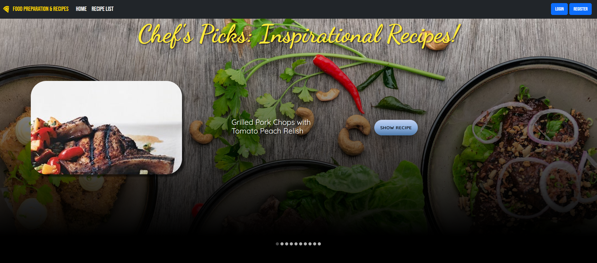
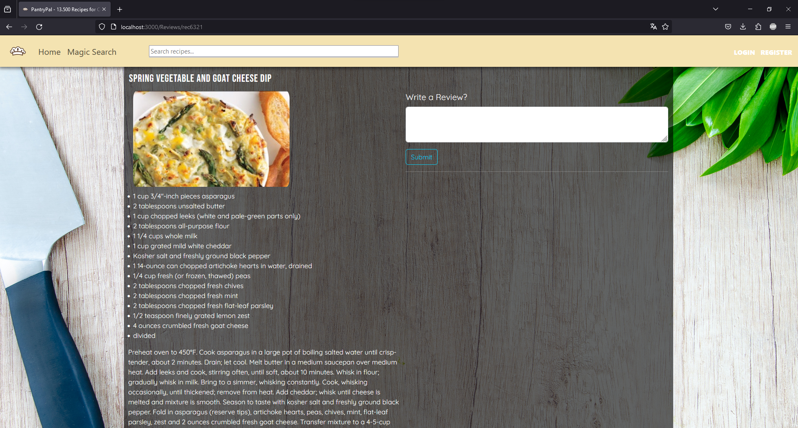

# RecipeApp

Recipe App is a full stack web application that provides access to a collection of 13,500 cooking recipes. Users can search for inspirational recipes based on the ingredients they have on hand.

## Table of Contents

- [About](#about)
- [Features](#features)
- [Technologies Used](#technologies-used)
- [Getting Started](#getting-started)
- [Usage](#usage)
- [Contributing](#contributing)
- [License](#license)
- [Acknowledgments](#acknowledgments)

## About

Recipe App is a full-stack web application that combines a Java Spring Boot backend for managing recipes saved in a MongoDB Database with a React frontend for a seamless user experience. The backend stores and retrieves recipes, while the frontend provides an intuitive interface for users to search and explore recipes based on available ingredients.

## Features

(Under construction)
- Access to a collection of 13,500 cooking recipes.
- Search for recipes based on available ingredients.
- User-friendly interface for a smooth browsing experience.

TODO:
- [x] Backend setup and running
- [x] Database setup and running
- [x] Frontend setup and running
- [x] Ability to leave reviews on recipes that get saved in the database
- [x] Pull randomized recipes from Backend to display on front carousel
- [x] Show ingredients, instructions of chosen recipe with picture
- [x] Handle decoding of pictures saved in binary in the database
- [ ] Implement recipe searching
- [ ] Submit own ingredients as text to get recipe suggestions
- [ ] Submit a picture of own ingredients and make AI detect ingredients and suggest recipes

## Technologies Used

- **Backend:**
  - Java Spring Boot

- **Frontend:**
  - React

- **Database:**
  - MongoDB

## Getting Started
## Usage
## Contributing
## License
## Acknowledgments
